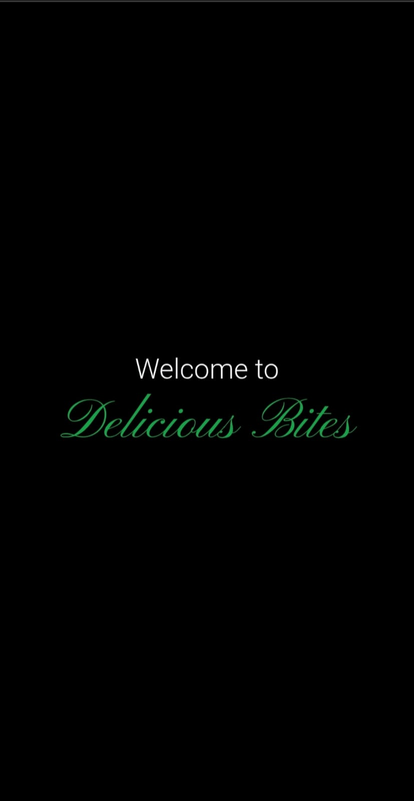
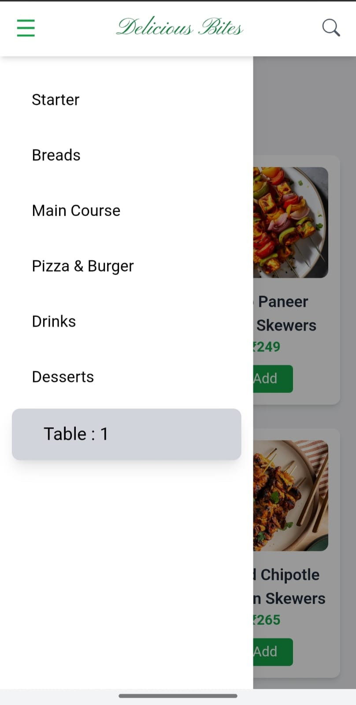
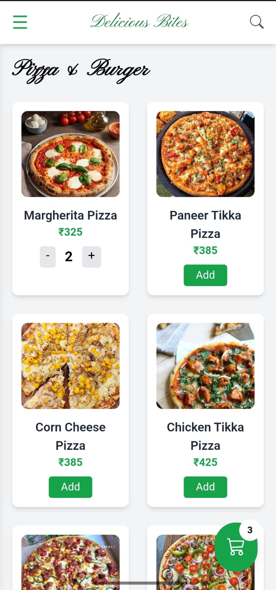
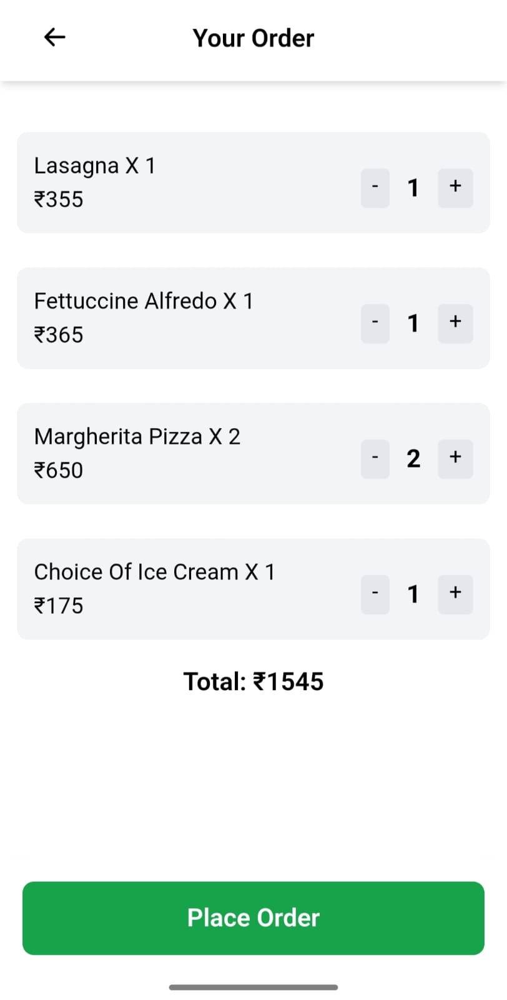
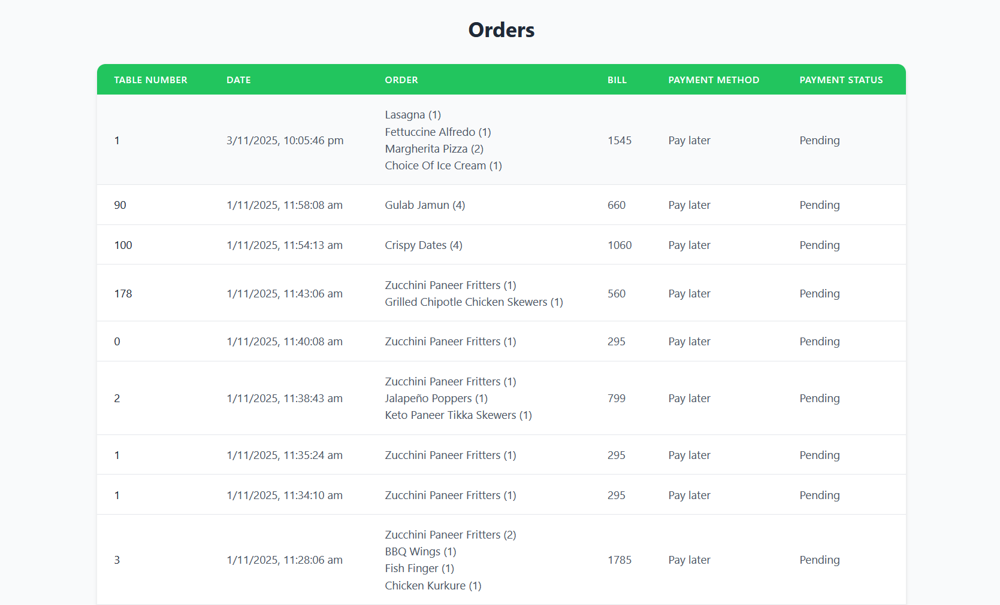
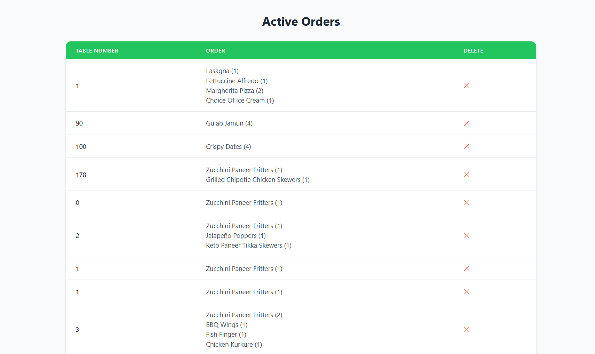

# 🍽️ QR Restaurant Ordering System
A full-stack web application that allows customers to scan a **unique QR code** placed on each restaurant table to browse the menu, place orders, and choose between **online payment** or **pay later** options. The system also includes **Admin** and **Chef dashboards** for managing menu items and tracking live orders in real time.
## 🚀 Features

### 🧑‍🍳 Customer Side
- Scan the QR code to access the restaurant’s digital menu.
- Browse and add items to the cart.
- Choose payment mode: **Online Payment** or **Pay Later**.
- View order summary and total bill before confirming the order.

### 👨‍💼 Admin Dashboard
- View and manage orders from different tables.
- Monitor real-time order updates.

### 👨‍🍳 Chef Dashboard
- View live incoming orders table-wise.
- edit or delete menu items.
- Auto-refresh order list on new updates.

- ## 🛠️ Tech Stack

| Category | Technologies |
|-----------|--------------|
| **Frontend** | HTML, Tailwind CSS, JavaScript, Bootstrap Icons |
| **Backend** | Node.js, Express.js |
| **Database** | MongoDB |
| **Authentication** | JWT (JSON Web Token) |
| **Environment Variables** | dotenv |

- ## 💳 Payment Flow

- User selects Place Order → payment modal appears.
- Choose Online Payment or Pay Later.
- Online payment confirms via frontend integration (e.g., GPay/Razorpay API).
- On success, order details are stored in MongoDB under that table’s session ID.

  - ## 🔐 Authentication

- Admin and Chef have secure logins verified through JWT tokens.
- Customers do not need a login — they are identified using a unique sessionId stored per table.

## Table QR Codes

### Table 1


### Table 2


### Table 3


## 📸 Screenshot

### 📌 Home Page


### 📌 overview Page


### 📌 menu Page


### 📌 cart Page


### 📌 Admin Dashboard Page


### 📌 Chef Dashboard Page



## ⚙️ Installation & Setup

1. **Clone the Repository**
   ```bash
   git clone https://github.com/your-username/QR-Restaurant-Ordering-System.git
   cd QR-Restaurant-Ordering-System
2. **Install Dependencies** : 
    npm install
3. **Setup Environment Variables**
  Create a .env file in the root folder and add:
    MONGO_URI=your_mongodb_connection_string, 
    JWT_SECRET=your_secret_key
4. **Run the Server** : 
   node index.js
   
**📄 License**

This project is open-source and available under the MIT License

